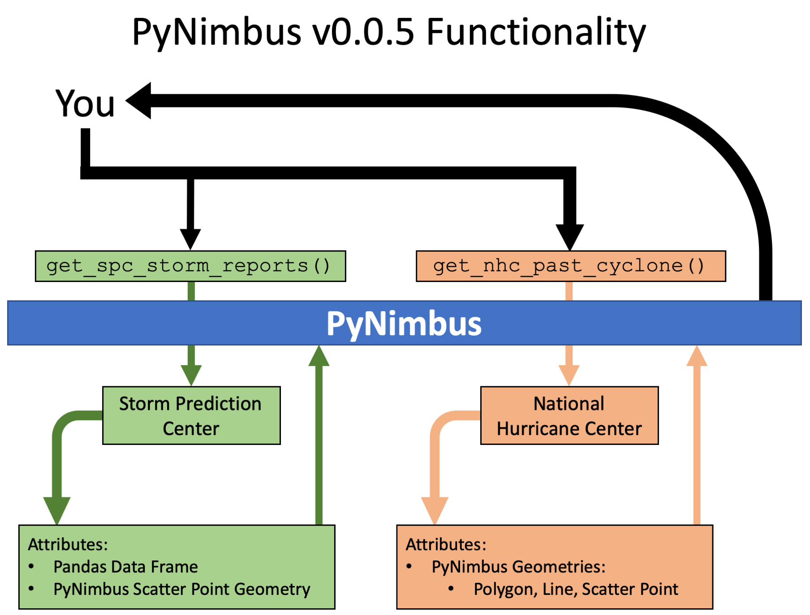

.. pynimbus documentation master file, created by
   sphinx-quickstart on Sat Aug 31 11:43:55 2019.
   You can adapt this file completely to your liking, but it should at least
   contain the root `toctree` directive.

Welcome to the PyNimbus documentation!
======================================
PyNimbus is a Python package that aims to aid the process of obtaining select National Weather Service products and organizing the data of the product in a "ready to go" format. This "ready to go" format is designed to be able to be immediately integrated in any project/application that requires data analysis or visualization.

.. toctree::
   :maxdepth: 3

   installguide
   SPC Storm Reports <tutorials/stormreports>
   NHC Cyclones <tutorials/nhccyclones>

Here is a general overview of how PyNimbus works on both the user-end and on the "back-end":

Note that PyNimbus follows a naming convention, which is (not explicitly) shown in the above chart. This naming convention is as such:

.. code-block:: python

	pynimbus.get_<NWS Branch>_<Product>(**kwargs, *args)

For example, if we wanted to get cyclone information from the National Hurricane Center:

.. code-block:: python

	pynimbus.get_nhc_previous_cyclone(**kwargs, *args)

Note that some of the functions listed above may not be in PyNimbus at the current moment. PyNimbus is still under development, but is useable in its current state.

Indices and tables
==================

* :ref:`genindex`
* :ref:`modindex`
* :ref:`search`
