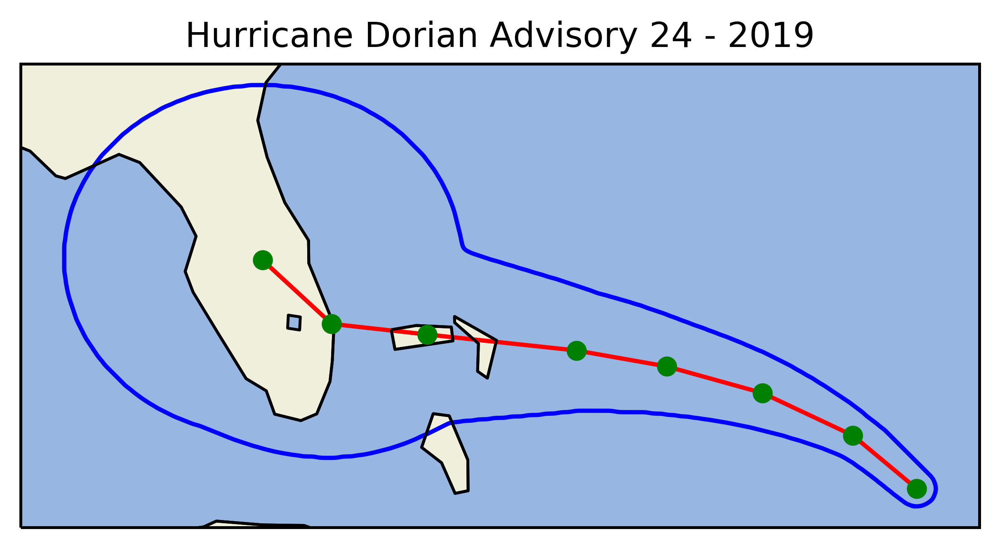

National Hurricane Center Cyclone Tutorial
==========================================

This tutorial will explain how to go about retrieving a past hurricane from the National Hurricane Center. In addition, it will demonstrate how to plot the outlooks using Cartopy.

Specifically, this tutorial explains how to use ``get_nhc_past_cyclone``. Throughout this entire tutorial, Hurricane Dorian's data set will be used from the National Hurricane Center.

-------
Summary
-------

This function retrieves a specified hurricane and saves the polygon, line, and points in an object as an attribute. It utilizes PyNimbus geometries, which are Shapely polygons built for PyNimbus purposes.

Required arguments: 

``name`` (string) - The name of the cyclone. Capitalization doesn't matter.  

``year`` (integer) - The year of the cyclone specified in YYYY form (i.e. 2018). Records only go back to 2008. The current year may or may not be updated as data gets updated in the NHC server.

``advisory_num`` (integer) - The advisory number for the specified cyclone. Note that intermediate advisories are not considered as of the latest release (v0.0.5)

Optional arguments: 

``clean_files`` (boolean) - Defaulted to True. Will clean up the files downloaded.

``extract_dir`` (string) - The directory where to extract the files. By default, the files get downloaded to the current working directory.

-------------------
Retrieving the data
-------------------

First, we will call the function to retrieve the information:

.. code-block:: python
    
	import pynimbus as pyn
	dorian = pyn.get_nhc_past_cyclone("dorian", 2019, 24)

This will return an object containing the polygon, line, and points as attributes:

.. code-block:: python

	>>> dorian.polygon
        PyNimbus Polygon Geometry object.
	   Number of Points: 1876
	   Max Latitude:     -85.1301
	   Max Longitude:    23.46636
	   Min Latitude:     -68.7397
	   Min Longitude:    31.3947
           Center Point:     (-79.24563562858884, 27.354134571268858)

	>>> dorian.line
	PyNimbus Line Geometry object.
	   Number of Points: 8
	   Max Latitude:     -81.4
	   Max Longitude:    23.8
	   Min Latitude:     -69.1
	   Min Longitude:    28.1
	   Center Point:     (-75.23006110816756, 26.12241608285046)

	>>> dorian.points 
	PyNimbus Scatter Points Geometry object.
	   Number of Points: 8
	   Max Latitude:     -81.4
	   Max Longitude:    23.8
	   Min Latitude:     -69.1
	   Min Longitude:    28.1

----------------------
Plotting Using Cartopy
----------------------

.. code-block:: python

	# import cartopy, matplotlib, and PyNimbus
	import cartopy.crs as ccrs
	import cartopy.feature as cfeature
	import matplotlib.pyplot as plt
	import pynimbus as pyn

	# pynimbus stuff
	# download the shapefiles (and delete after)
	dorian = pyn.get_nhc_past_cyclone("dorian", 2019, 24)
	
	# get line, polygon, and points ready to plot
	poly_lat, poly_lon = dorian.polygon.lat_lon_to_plot()
	line_lat, line_lon = dorian.line.lat_lon_to_plot()
	point_lat, point_lon = dorian.points.lat_lon_to_plot()

	# cartopy stuff
	plt.close('all')
	ax = plt.axes(projection=ccrs.PlateCarree())
	ax.add_feature(cfeature.OCEAN)
	ax.add_feature(cfeature.LAND, edgecolor='black')
	ax.add_feature(cfeature.LAKES, edgecolor='black')
	ax.add_feature(cfeature.RIVERS)
	ax.add_feature(cfeature.BORDERS)
	ax.add_feature(cfeature.COASTLINE)
	plt.plot(poly_lat, poly_lon, color = 'blue', zorder = 0)
	plt.plot(line_lat, line_lon, color = 'red', zorder = 1)
	plt.scatter(point_lat, point_lon, color = 'green', zorder = 2)
	plt.title("Hurricane Dorian Advisory 24 - 2019")
	plt.show()     

The above code will get you this map:

-----------
Save to CSV
-----------

Simply call the pandas ``to_csv`` method:  

.. code-block:: python
    
     import pandas as pd
     import pynimbus as pyn
     link = "https://www.spc.noaa.gov/climo/reports/160524_rpts_filtered.csv"
     df = pyn.get_spc_storm_reports_df(link, type_of_df = 'tornado')
     df.to_csv("/path/to/save/csv")

It was decided to not integrate this directly into PyNimbus, as the above is easier on the user-end. However, a future version may have integration.  

--------------------
Additional resources
--------------------

- `PyNimbus GitHub repository <https://github.com/WxBDM/PyNimbus>`_

Last updated: 10/13/19

