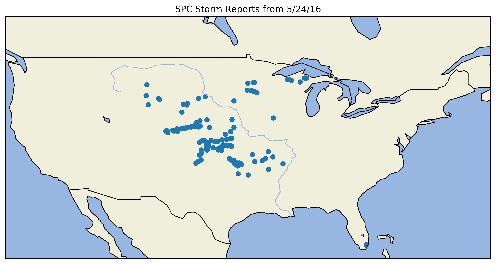

Storm Prediction Center Storm Reports Tutorial
==============================================

This tutorial will explain how to go about retrieving a storm report, found on the `SPC Storm Reports page <https://www.spc.noaa.gov/climo/reports/today.html>`_. 

Specifically, this tutorial explains how to use ``get_spc_storm_reports``. 

Note: In versions before 0.0.5, the function was ``get_spc_storm_reports_df``. This was changed to ``get_spc_storm_reports`` for portability purposes. To remain backwards compatible, you can still call ``get_storm_reports_df``, but it will be removed by v0.0.7.

-------
Summary
-------

This function takes a storm reports CSV file (URL or local file) and returns an object containing a pandas dataframe and a PyNimbus Scatter Point geometry. 

Required argument: ``url_or_path`` (string)- The URL to the storm reports CSV *or* path to CSV

Optional argument: ``type_of_df`` (string)- The hazard to be filtered by; either all, tornado, wind, or hail. Default: all

----------------------
Retrieving the reports
----------------------

.. code-block:: python
    
	import pynimbus as pyn
	link = "https://www.spc.noaa.gov/climo/reports/today_filtered.csv"
	today_reports = pyn.get_spc_storm_report(link)

This will return an object with all 3 hazards: tornado, wind, and hail (as this is the default value; more on this later). In addition, it gives you a pandas data frame (which can be accessed by ``today_reports.df``) and a PyNimbus Scatter Point geometry (which can be accessed by ``today_reports.points``).

-----------------------
Working with parameters
-----------------------

Suppose you wanted to retrieve all of reports from 5/24/2016; simply change the link to the CSV file:

.. code-block:: python
    
    import pynimbus as pyn
    link = "https://www.spc.noaa.gov/climo/reports/160524_rpts_filtered.csv"
    ddc_reports = pyn.get_spc_storm_reports_df(link)

But now suppose you only want the tornado reports:  

.. code-block:: python
    
     import pynimbus as pyn
     link = "https://www.spc.noaa.gov/climo/reports/160524_rpts_filtered.csv"
     ddc_reports = pyn.get_spc_storm_reports_df(link, type_of_df = 'tornado')

Likewise, with wind or hail, you would change the ``type_of_df`` parameter to either "wind" or "hail".

Working with the link to retrieve a certain day
^^^^^^^^^^^^^^^^^^^^^^^^^^^^^^^^^^^^^^^^^^^^^^^

Note: in future versions, you will not have to include the link as a parameter. Instead, it will be a date in MMDDYY format.

To make things easy, below are links to the associated CSV files on the SPC website.

"Today" storm reports: ``"https://www.spc.noaa.gov/climo/reports/today_filtered.csv"``

"Yesterday" storm reports: ``"https://www.spc.noaa.gov/climo/reports/yesterday_filtered.csv"``

YYMMDD storm reports: ``"https://www.spc.noaa.gov/climo/reports/YYMMDD_rpts_filtered.csv"``

----------------------
Plotting Using Cartopy
----------------------

.. code-block:: python

	import cartopy.crs as ccrs
	import cartopy.feature as cfeature
	import matplotlib.pyplot as plt
	import pynimbus as pyn

	# pynimbus stuff
	url = "https://www.spc.noaa.gov/climo/reports/160524_rpts_filtered.csv"
	reports = pyn.get_spc_storm_reports(url, type_of_df = 'all')
	lat, lon = reports.points.lat_lon_to_plot()

	# cartopy stuff
	plt.close('all')
	plt.figure(figsize=(12, 6))
	ax = plt.axes(projection=ccrs.PlateCarree())
	ax.set_extent([-125, -65, 24, 50.5])
	ax.add_feature(cfeature.OCEAN)
	ax.add_feature(cfeature.LAND, edgecolor='black')
	ax.add_feature(cfeature.LAKES, edgecolor='black')
	ax.add_feature(cfeature.RIVERS)
	ax.add_feature(cfeature.BORDERS)
	ax.add_feature(cfeature.COASTLINE)
	plt.scatter(lon, lat)
	plt.title("SPC Storm Reports from 5/24/16")
	plt.show() 
	
The above code will get you this map:

-----------
Save to CSV
-----------

Simply call the pandas ``to_csv`` method:  

.. code-block:: python
    
     import pandas as pd
     import pynimbus as pyn
     link = "https://www.spc.noaa.gov/climo/reports/160524_rpts_filtered.csv"
     reports = pyn.get_spc_storm_reports(link, type_of_df = 'tornado')
     reports.df.to_csv("/path/to/save/csv")

--------------------
Additional resources
--------------------

- `Pandas 0.25.0 documentation <https://pandas.pydata.org/pandas-docs/stable/>`_
- `PyNimbus GitHub repository <https://github.com/WxBDM/PyNimbus>`_

Last updated: 10/13/19

